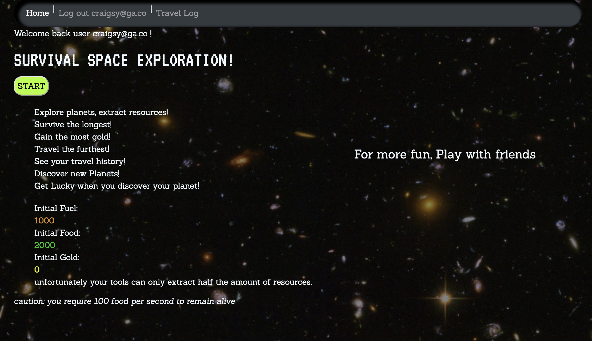

# SURVIVAL SPACE EXPLORATION
> Play Survival Space Exploration! Free! [HERE](https://fierce-coast-57097.herokuapp.com/)

## Table of Contents
* [General Info](#general-information)
* [Technologies Used](#technologies-used)
* [Features](#features)
* [Screenshots](#screenshots)
* [Setup](#setup)
* [Project Status](#project-status)
* [Room for Improvement](#room-for-improvement)
* [Acknowledgements](#acknowledgements)
* [Contact](#contact)
<!-- * [License](#license) -->

## General Information
A CRUD style web browser game you can play to test you luck! Search the universe for bountyful planets! extract resources! survive the longest! Become the richest space faring explorer the Universe has ever seen!

### What is the purpose of this project?
To explore and demonstrate crud style game development

### Why did I undertake this project?
To understand Ruby on rails and how to integrate a wider variety of technologies in a single project.

## Technologies Used
- Ruby on Rails
- jQuery v3.6.0
- heroku
- HTML5
- W3. CSS 4.15
- Javascript ES6 (ECMAScript 2018)
- Ruby Gem Bootstrap v4.6.1
- bcrypt 3.1.7
- Ruby Gem Random name generator v2.0.1 by folkengine

## Features
List the ready features here:
- SignUp/SignIn with password authentication
- Administrator permissions
- New game button
- Random number game mechanics
- Random name generator

## Screenshots

## Setup
Play here: https://fierce-coast-57097.herokuapp.com/

## Project Status
Project is: _in progress_

## Room for Improvement

Room for improvement:
- draw line to show a win
- allow players to customize their tokens (X, O, name, picture)
- use local storage to persist data locally to allow games to continue after page refresh or loss of internet connectivity.
- support custom board sizes. (4x4, 5x5, 6x6)
- support networked multiplayer
- create AI opponent
- allow players to type in co-ordinates

## Acknowledgements
- This project was inspired by: General Assembly
- Many thanks to: Joel as Instructor and Loden as TA for SEI54

## Contact
adrian.greksa@gmail.com
